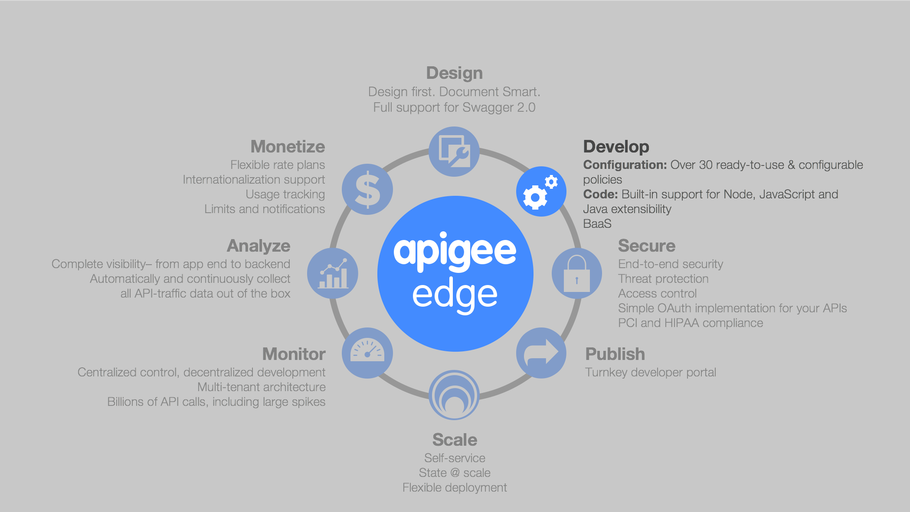
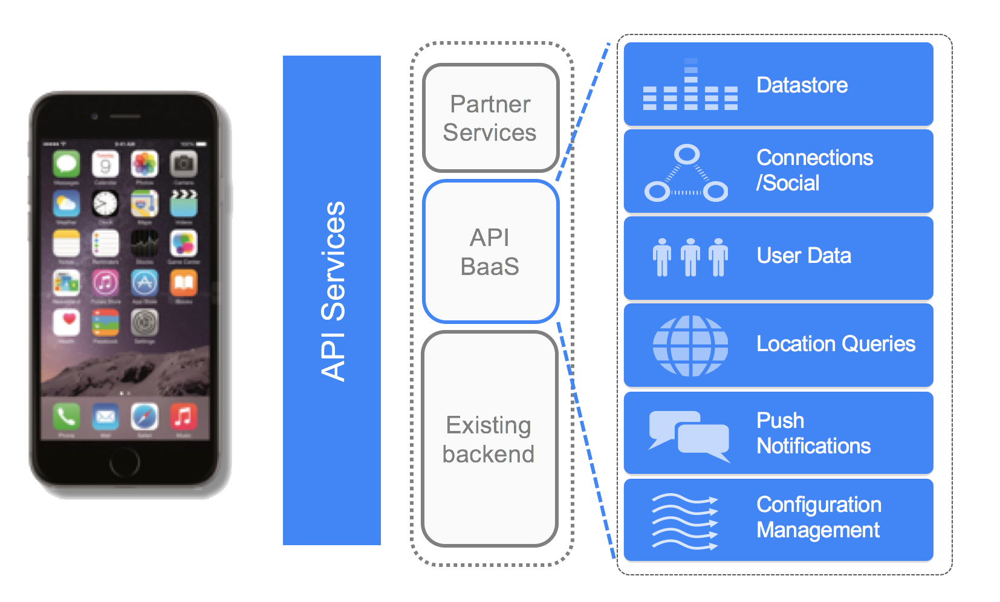
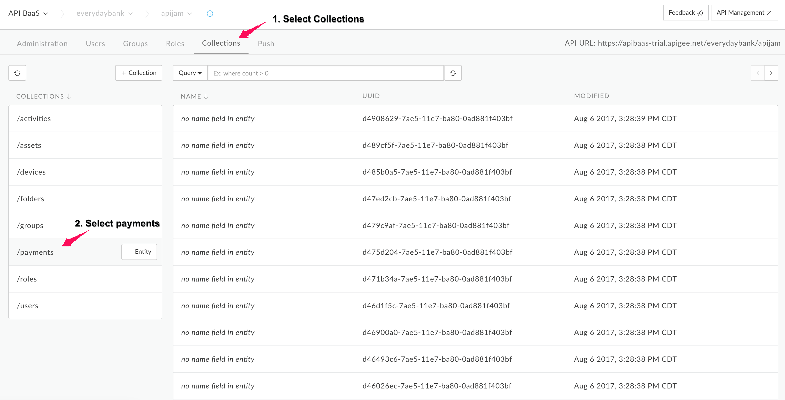
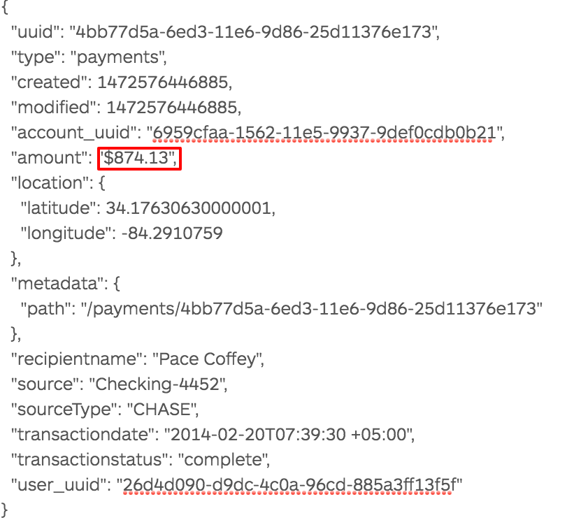
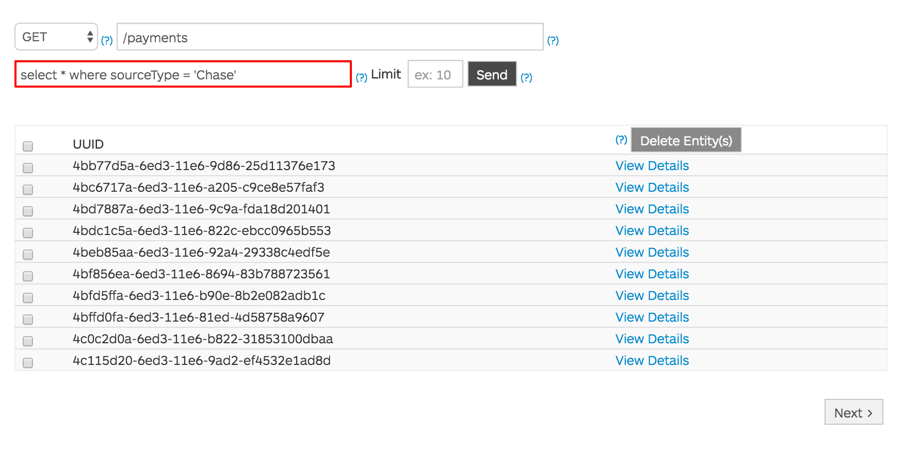

# Lab 10 - Introduction to API BaaS (Backend-as-a-Service)*

*Duration : 30 mins*

*Persona : API Team*

# Use case
Using API BaaS, you can set up your own cloud-based data platform in
minutes instead of months – no server-side coding or back-end
development needed. This allows your team to focus on developing the
rich features and user experience that truly differentiate your app,
rather than on the time-consuming details of implementing core back-end
services and infrastructure.

# How can Apigee Edge help?

Edge API Services includes a backend-as-a-service (BaaS) solution that
provides you with access to a flexible data store and enables you to
quickly integrate valuable features into your app, including social
graphs, user management, data storage, push notifications, performance
monitoring, and more.

API Baas provides the following features:

**Data storage & management**

***Application data***

At the core of the BaaS is a flexible platform that can store any type
of application data, from simple records like a catalog of books to
complex associations like user relationships. No matter what type of
data drives your app, you can store it as collections of data entities
and immediately perform complex queries or full-text searches on any
field. You can also create custom entities with custom properties,
giving you the ability to store data and context in a way that makes
sense for your app.

To learn more about entities and collections, see [API BaaS Data
model](http://apigee.com/docs/app-services/content/app-services-data-model-1).

For a complete list of the default data entities available, see [Default
Data
Entities](http://apigee.com/docs/app-services/content/default-data-entities).

***Files & assets***

Images, video, and audio are key components of a great app experience.
With BaaS, you can upload and retrieve binary objects from the same data
store as the rest of your application data, eliminating the need to set
up content delivery networks (CDNs) and easing implementation. BaaS
handles all the back-end details that keep your content quickly
accessible.

To learn more about files and asset storage, see [Uploading files and
assets
](http://apigee.com/docs/app-services/content/uploading-files-and-assets).

***Flexible data querying***

One of the BaaS' most powerful features is the ability to perform
SQL-style queries and full-text searches on data entities, as well as
their properties. This lets you quickly retrieve specific data entities
based on multiple criteria, then utilize that data to power social
features, target push notifications, perform user analysis, and more.

Learn more about querying app data, see [Data query
overview](http://apigee.com/docs/app-services/content/app-services-data-query-overview).

**Social**

***Entity relationships***

You can create relationships between data entities to help build
features, improve user experience, and contextualize data. For example,
you might associate a user with their devices to capture valuable
geolocation data, create relationships between users to build social
graphs, or implement popular features such as activity streams.

To learn more about entity relationships, see [Entity
connections](http://apigee.com/docs/app-services/content/entity-relationships).

***Activity streams***

A key aspect of social networking apps is the ability to provide and
publish data streams of user actions, such as ongoing lists of comments,
activities, and tweets. API Services simplifies management and routing
of these data streams by providing an activity entity that is
specifically designed to automatically create a relationship between
activities and the user who created them.

To learn more about activities and activity feeds, see [Activity
feeds](http://apigee.com/docs/app-services/content/activity).

**User management**

***Registration and login***

You can easily add and manage users by providing the core services
necessary to handle secure registration and login, including OAuth
2.0-compliant client authentication. In addition, any number of default
or custom data entities and properties can be associated with a user
entity to create complete user profiles.

To learn more about user management, see
[User](http://apigee.com/docs/app-services/content/user).

To learn more about authentication, see [Authenticating users and
application
clients](http://apigee.com/docs/app-services/content/authenticating-users-and-application-clients).

***Roles & permissions***

Applications often require the ability to configure fine-grain control
of user access to data, features and functionality. API Services solves
the implementation details of user access with roles and permissions.
Simply create roles that represent user types or access levels, such as
Administrator, then assign the necessary permissions to that role. With
a single API call, you can then associate your roles with any user or
group of users.

To learn more about user roles and permissions, see [Managing access by
defining permission
rules](http://apigee.com/docs/app-services/content/managing-access-defining-permission-rules).

***Groups***

Groups are a flexible way to organize your users based on any number of
criteria. For example, you might group users based on interests or
location to more effectively deliver relevant content, target offers, or
customize campaigns. You can also take advantage of the groups entity to
enable group-based social networking activities, such as allowing your
users to create private information feeds or circles of friends.

To learn more about groups, see [Working with group
data](http://apigee.com/docs/app-services/content/group).

***Third-party authentication***

In addition to supporting user management and OAuth-based login for your
app, API Services also makes it easy to integrate third-party
authentication through such popular services as Facebook, Twitter and
other OAuth-enabled accounts. Providing third-party sign-in can improve
user experience, while increasing adoption, giving you access to
valuable information from social networks and services.

To learn more about using third-party sign-in, see [Facebook sign
in](http://apigee.com/docs/app-services/content/facebook-sign).

***Geolocation***

The device entity allows you to capture geolocation data from your
users' GPS-enabled devices to more effectively target campaigns, push
notifications, offers and more. Geolocation also gives you an important
data point for contextualizing and analyzing trends and user behavior.

To learn more about geolocation, see
[Geolocation](http://apigee.com/docs/app-services/content/geolocation).

**Push notifications**

Push notifications are the most effective way to engage your users with
relevant content, and thanks to API Services, implementing them can be
done in minutes. Simply register your app and your user's devices with a
notification provider, such as Apple Push Notification Service or Google
Cloud Messaging, then use the API Services notification entity to send
millions of push notifications a month at no cost. When used in
conjunction with queries of user and application data, push
notifications become a powerful tool for leveraging user data, ensuring
relevancy and driving engagement.

To learn more about push notifications, see [Push notifications
overview](http://apigee.com/docs/app-services/content/push-notifications-overview).

**Configuration management**

By giving you the ability to push configuration changes directly to
users' devices, API Services lets you test and deliver bug fixes and
performance improvements in real time. Remote configuration management
can even be used to push changes to a subset of all users, enabling A/B
testing of fixes, so that you can monitor and collect data to ensure
your updates perform as intended before they are pushed to your entire
user base.

To learn more about configuration management, see [Configure your app
](http://apigee.com/docs/app-services/content/configure-your-app).

**Error & performance monitoring**

One of the largest barriers to the success of an app can be the ability
of developers to respond quickly and precisely to performance issues and
bugs. API Services includes data logging and visualization tools that
let you monitor and analyze network performance, usage patterns, crash
statistics and other key metrics, giving you the data necessary to
quickly manage performance issues as they arise.

To learn more about usage monitoring, see [Monitor your app’s
use](http://apigee.com/docs/app-services/content/monitor-your-app%E2%80%99s-use)

To learn more about error monitoring, see [Get alerted to crashes and
critical
errors](http://apigee.com/docs/app-services/content/get-alerted-crashes-and-critical-errors)

**Objectives**

The objective of this lesson is to provide an overview of API
Backend-as-a-Service (BaaS). This includes interacting with data
collections, calling the RESTful services exposed automatically by BaaS,
and using the BaaS query language against the data collection.

# Pre-requisites

*   Your Apigee Edge organization name, user name, and the password
*   Your API BaaS organization name and application name.

Ask your Instructor for Organization and application details.

# Instructions

**Interacting with Data Collections** in the BaaS can be done easily from the BaaS portal. The BaaS portal provides a user interface built using the RESTful APIs automatically exposed by BaaS for data collections. We will review a data collection called ‘payments’ in your BaaS instance (this can be accessed from the top right menu in the Edge UI or by following step a below).

> 

*  Select the API Baas Option under the Develop section:
*  Pick your API BaaS organization 'everydaybank' from the Organization drop-down
*  Pick the ‘apijam’ App from the App drop-down

> 

*  From the BaaS tab options, select ‘Collections’
*  From the Data collections, select ‘payments’

> 

*  On the right hand side, all the entities that are part of the
    ‘payments’ collection is presented

*  Click on the row of one of the entity of the payment entities
*  Browse through the details to review the attributes presented in a
    formatted name-value pair. For example, attributes such as
    amount, source, sourceType, location: latitude, location:
    longitude, etc.

> 

* Change the value of 'amount’ attribute to another number and then click 'Check JSON' and 'Save'

> 

*  Click on ‘Save’ to save the change you just made.
*  Click on the row for the entity to close the record and browse to the top

**Extra Credit:** Add a new entity to the ‘payments’ data collection
using the ‘POST’ operation available in the BaaS portal.

***Hint:*** Remove the uuid and type attributes in case you copy-paste
from an existing entity.

________________________________________________________________________

   **Paging through results** is supported inherently by BaaS. By
    default, the GET API for data collections in BaaS returns 10
    entities at a time. This can be changed by providing a ‘limits’
    query parameter when calling the API. To page through the results,
    API BaaS provides a cursor attribute, which can be used in
    subsequent calls

*  Open up another browser tab and go to
        > https://apibaas-trial.apigee.net/{your-org}/apijam/payments
        
Replace **{your-org}** with the actual name of your API BaaS
organization name.

  **Note**: The 'sandbox' App created for these lab exercises has
  been configured so that the Guest role has full permissions (that is,
  /\*\* for GET, POST, PUT, and DELETE) to all the data collections in
  the App. As with any other app, you can secure the application by
  updating its roles and permissions. For more on working with
  permissions and roles, see [Managing access by defining permission
  rules](http://apigee.com/docs/app-services/content/managing-access-defining-permission-rules).

*  Effectively you’ve called the GET API for the ‘payments’ data
    collection by calling the above URL. Review the information
    presented in JSON format. This is the same information you
    previously saw on the BaaS portal.

*  Browse towards the bottom of the response. You’ll notice that by
    default BaaS provides 10 entities at a time. This can be verified
    by looking at the attribute "count" : 10

*  Now call the GET API as follows with the limits parameter

> https://apibaas-trial.apigee.net/{your-org}/apijam/payments?limit=5

Replace **{your-org}** with the actual name of your API BaaS
organization name.

*  Review the results and you’ll notice that BaaS has returned 5 payments
    instead of 10 this time around

*  To page forward to the next set of results, copy the value of the
    ‘cursor’ attributed provided at the bottom of the results and call
    the GET API again after adding the query parameter ‘cursor={cursor
    value}’ to the URL.

*  Using cursors, page forwards and backwards through the results. By
    keeping track of the cursor values, one can start to provide
    paging functionality within an App when using these APIs.

<!-- -->
________________________________________________________________________

**Querying data** is also easily accomplished by using API BaaS’
    query language capabilities.

*  Go back to the BaaS portal

*  While in the ‘payments’ collection, use the ‘GET’ method to query
        for payments with a sourceType of 'VISA'

> 

*  Run the query and review the results. You’ll notice that only those
    payments made with 'VISA' are returned.

*  Try a few of the following other queries to get a better
    understanding of how data querying works in BaaS:

    -   select * where sourceType = 'VISA'
    -   select * where amount > 900
    -   select * where sourceType = 'VISA' and amount < 500
    -   select * where source contains 'Checking'

*  These queries can also be provided as parameters to the GET API by
    using the ‘ql’ query parameter. Switch to the browser tab used to
    issue GET API calls directly against the BaaS.

*  Call the GET API as follows to get payments with a source of 'VISA'

> https://apibaas-trial.apigee.net/{your-org}/finance/payments?ql=select%20*%20where%20sourceType=%27VISA%27

Replace **{your-org}** with the actual name of your API BaaS
organization name.

**Note**: Most browsers will URL encode special characters
automatically

*  Try the other query examples provided earlier and use them as the
    value of the ‘ql’ parameter of the GET API call.

## Summary

That completes this hands-on lesson. We have barely scratched the
surface of Apigee API BaaS capabilities. In this lab we learned how data
is stored in an easy-to-consume format, how it can be accessed and
interacted with using the BaaS portal and RESTful APIs automatically
exposed by BaaS, and how to easily query the data including full-text
searching. For further information refer to the API BaaS
[*documentation*](http://apigee.com/docs/developer-services/content/add-and-edit-content).

## Additional References

* Useful Apigee documentation links on BaaS - 

    * BaaS documentation [http://docs.apigee.com/api-baas](http://docs.apigee.com/api-baas)
    * Push Notifications [http://docs.apigee.com/app-services/content/push-notifications-overview](http://docs.apigee.com/app-services/content/push-notifications-overview)
    * User Management and Social Graph [http://docs.apigee.com/app-services/content/user-management](http://docs.apigee.com/app-services/content/user-management)
    
# Rate this lab

How did you like this lab? Rate [here](https://goo.gl/forms/obedQHDbqXJ4heON2).

